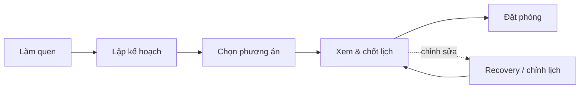

# Tóm tắt nghiệp vụ — VinTravel (AI Travel Planner)

Đây là **prototype sản phẩm** (không phải hệ thống production), mô phỏng một trợ lý AI giúp người Việt **tự lập lịch chuyến đi tự túc trong nước**. Dưới góc nhìn Product Management, bài toán được định nghĩa như sau.

---

## 1. Bài toán cốt lõi

**Pain point của người dùng (lời user thật):**

> *"Tôi muốn đi Đà Nẵng – Hội An 4 ngày nhưng không biết xếp lịch hợp lý — sợ một ngày quá nhiều điểm, quán ăn không khớp gu nhóm."*

Người dùng hiện giải quyết bằng Google, blog, Excel, hỏi bạn/Facebook — mất vài lần/tuần trong 1–2 tuần trước chuyến đi, vẫn lo lịch không hợp lý hoặc không tin được.

**Giải pháp sản phẩm:** VinTravel đưa ra **lịch trình theo ngày, đáng tin, có thể chỉnh sửa** — giúp giảm stress trước chuyến đi, không thay người dùng quyết định cuối cùng.

---

## 2. Định vị & phạm vi

| Đúng scope | Ngoài scope |
|---|---|
| Tự lập lịch chuyến đi tự túc | Chat khám phá chung (chỉ là trang phụ) |
| Gợi ý nhiều phương án lịch | Mua tour trọn gói |
| Chỉnh sửa & chốt bản nháp | Đặt phút chót, không cần lịch theo ngày |
| Chuẩn bị đặt phòng → chuyển đối tác | **Thanh toán, đặt vé, đặt phòng thay user** |

**Anti-persona:** người mua tour trọn gói; người đặt phút chót; người chỉ muốn hỏi đáp AI mà không cần lịch chi tiết.

---

## 3. Người dùng mục tiêu

- **Persona chính:** Cặp đôi / nhóm bạn **25–35 tuổi**, ít kinh nghiệm tự túc **miền Trung Việt Nam**
- **Use case đại diện:** 4 ngày Đà Nẵng – Hội An, ưu tiên di sản / ẩm thực / thiên nhiên
- **Mở rộng:** Quảng Bình – Phong Nha, Quảng Trị – DMZ, Huế, Sài Gòn…
- **Nhịp sử dụng tự nhiên:** Daily khi đang lập kế hoạch (3–10 ngày) → vài tháng/lần giữa các chuyến → gần như không dùng khi đang đi

---

## 4. Luồng nghiệp vụ chính (4 giai đoạn)

| Giai đoạn | Mục đích nghiệp vụ | Màn hình |
|---|---|---|
| **A — Làm quen** | Giải thích AI làm gì / không làm gì | Onboarding |
| **B — Lập kế hoạch** | Thu thập 5 thông tin chuyến đi, tạo phương án | Plan-trip |
| **C — So sánh & chọn** | Đưa nhiều hướng lịch, user tự quyết | Itineraries |
| **D — Xem & chốt** | Lịch theo ngày/giờ, chỉnh sửa, chốt bản nháp | Review |
| **E — Hành động tiếp theo** | Tóm tắt chuyến đi, chuyển sang đối tác đặt phòng | Booking |

**Core action (hành vi cốt lõi):** Chọn phương án lịch → xem bản nháp chi tiết theo ngày trên Review → (tuỳ chọn) chốt lịch trình.

---

## 5. Dữ liệu nghiệp vụ cần thu thập

Hệ thống thu thập **checklist 5 mục** trước khi sinh lịch:

1. **Đi đâu** — điểm đến / vùng
2. **Bao lâu** — số ngày
3. **Đi cùng ai** — cặp đôi, gia đình có trẻ, nhóm bạn, solo
4. **Ngân sách** — ước tính mỗi ngày (ăn uống, tham quan, chưa gồm khách sạn)
5. **Phong cách** — văn hóa & di sản / biển & thiên nhiên / ẩm thực

AI có thể **tự điền một phần** từ câu mô tả tự do (ví dụ *"4 ngày Đà Nẵng – Hội An, ưu tiên di sản"*), rồi **hỏi tiếp** các mục còn thiếu qua chip gợi ý.

---

## 6. Sản phẩm AI sinh ra gì?

Sau khi đủ thông tin, hệ thống đưa ra **nhiều phương án lịch trình** (không chỉ một đáp án duy nhất):

| Phương án | Đặc điểm |
|---|---|
| Di sản & phố cổ | UNESCO, làng nghề, phù hợp lần đầu miền Trung |
| Biển & núi Bà Nà | Thiên nhiên, hoạt động ngoài trời |
| Ẩm thực miền Trung | Quán địa phương, nhịp chậm |
| Phong Nha – DMZ – Huế | Multi-city, thiên nhiên + di tích lịch sử |

Mỗi phương án có **tiêu chí giải thích** (explainability) và badge "Phù hợp nhất" theo sở thích đã chọn — nhưng **user luôn là người quyết định**.

Lịch chi tiết gồm: **ngày → hoạt động theo giờ → loại hoạt động → ghi chú** (ví dụ Ngày 2 Hội An có 7 điểm, cảnh báo quá tải).

---

## 7. Quy tắc nghiệp vụ quan trọng (Act / Ask / Don't Act)

Đây là **khung quyết định mức độ tự chủ của AI** — xương sống nghiệp vụ của sản phẩm:

| Mức | AI được phép | Ví dụ |
|---|---|---|
| **Act** | Thao tác rủi ro thấp, hoàn tác được | Điền checklist, gợi ý chip, highlight thay đổi |
| **Ask** | Giả định lớn — cần user xác nhận | Tạo lịch khi thiếu ngân sách, chọn phương án, thay quán ăn |
| **Don't Act** | Hành động rủi ro cao — AI không làm | Thanh toán, đặt vé, gửi dữ liệu bên thứ ba |

**Nguyên tắc:** Rủi ro thấp → Act · Giả định lớn → Ask · Khó hoàn tác → Don't Act.

---

## 8. Các kịch bản nghiệp vụ then chốt

| Kịch bản | Vấn đề nghiệp vụ | Cách xử lý |
|---|---|---|
| **T2 — AI hỏi thêm** | Thiếu thông tin, AI không được đoán bừa | Hỏi tuần tự + modal xác nhận trước khi generate |
| **T4 — Nhiều phương án** | Một lịch không phải lúc nào cũng tối ưu duy nhất | 4 variant + tiêu chí so sánh |
| **T6 — Lịch quá dày** | AI ưu tiên "nhiều điểm" hơn thời gian nghỉ | Cảnh báo ⚠ → user chọn bỏ điểm → preview before/after → hoàn tác |
| **T7 — POI lỗi thời** | Quán đóng cửa, thông tin sai | Hiển thị nguồn + ngày cập nhật → user báo sai → AI hỏi chọn thay thế (không tự xóa) |
| **T9 — Đặt phòng** | Rủi ro thanh toán nhầm | Form thanh toán bị khóa → CTA chuyển Booking.com |

**Trạng thái lịch trình:** Luôn là **Bản nháp** cho đến khi user bấm **"Chốt lịch trình"** — nhấn mạnh user giữ quyền kiểm soát.

---

## 9. Chỉ số thành công (Product Metrics)

| Metric | Ý nghĩa |
|---|---|
| **North Star Metric** | Số lịch chốt / 100 người lập kế hoạch |
| **Activation / Aha** | User thấy banner *"Đây là lịch nháp của bạn"* + lịch theo ngày trên Review |
| **Retention chính** | % user quay lại chỉnh lịch trong **7 ngày** sau khi xem Review |
| **Retention dài hạn** | % quay lại lập chuyến mới trong **90 ngày** |

**Không dùng DAU** — đây là sản phẩm theo đợt (lập kế hoạch 1–2 tuần trước chuyến), không phải app dùng hàng ngày cả năm.

---

## 10. Mô hình kinh doanh ngầm định

- **Giá trị cốt lõi:** Lập lịch thông minh, giảm friction trước chuyến đi
- **Monetization path (gợi ý từ luồng):** Chuyển tiếp sang **đối tác đặt phòng** (Booking.com) sau khi user đã chốt lịch — VinTravel không xử lý thanh toán
- **Trust layer:** Explainability (tiêu chí phương án), nguồn POI, recovery loop, hoàn tác — xây niềm tin vì AI có thể sai

---

## 11. Bối cảnh dự án (lab evolution)

Repo này không chỉ là app demo — nó là **artifact học tập qua 3 ngày lab**:

| Ngày | Trọng tâm |
|---|---|
| **Day 18** | Prototype + tương tác AI (vòng đời user, Act/Ask/Don't Act, feedback 2×2) |
| **Day 20** | Retention & habit loop (onboarding rút gọn, NSM, tracking events) |
| **Day 21** | Scenario dataset cho AI evals (32 test inputs, 15 combinations — đánh giá chất lượng AI ở bước plan-trip) |

---

## Tóm lại một câu

**VinTravel giải bài toán: giúp du khách Việt Nam tự túc — đặc biệt miền Trung — có một lịch trình theo ngày hợp lý, minh bạch, sửa được, trong vài phút; AI hỗ trợ gợi ý và chỉnh sửa nhưng không tự quyết thay user ở các hành động rủi ro cao (đặt vé, thanh toán).**
